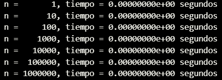
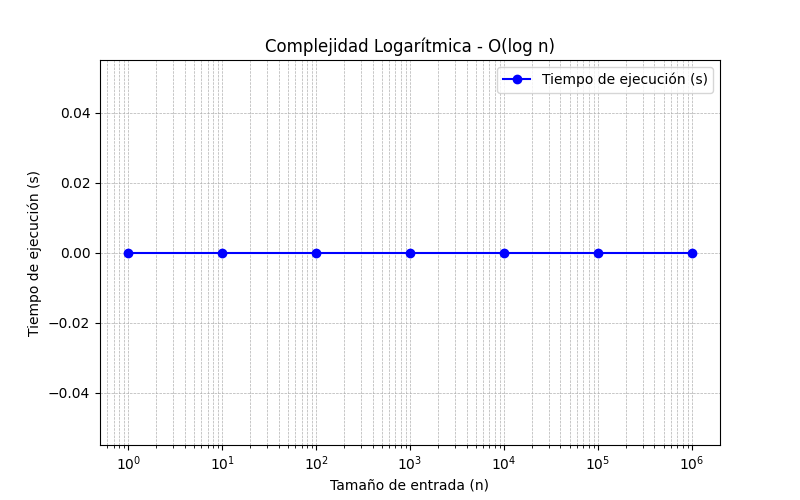
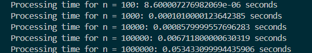
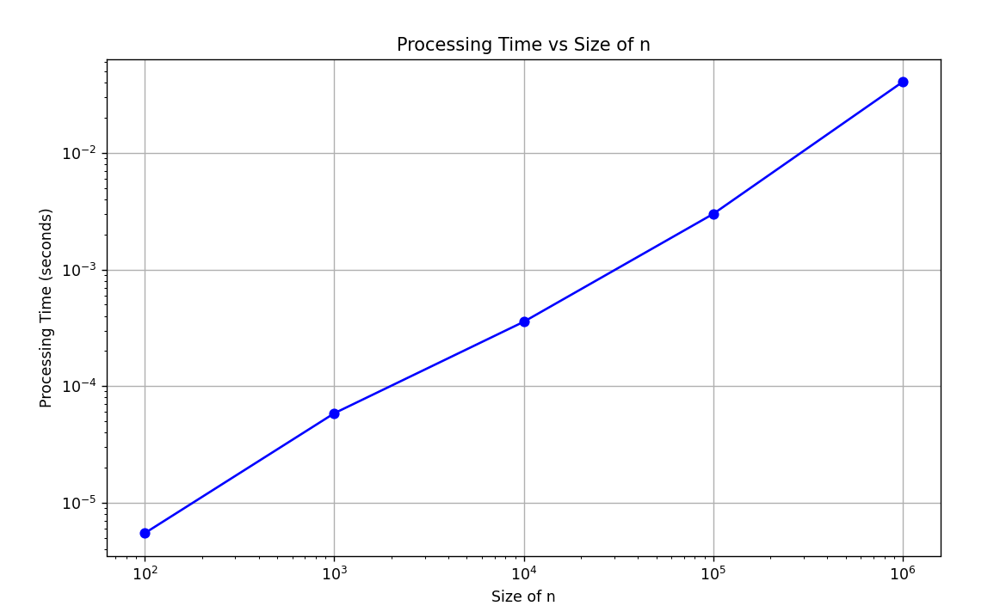
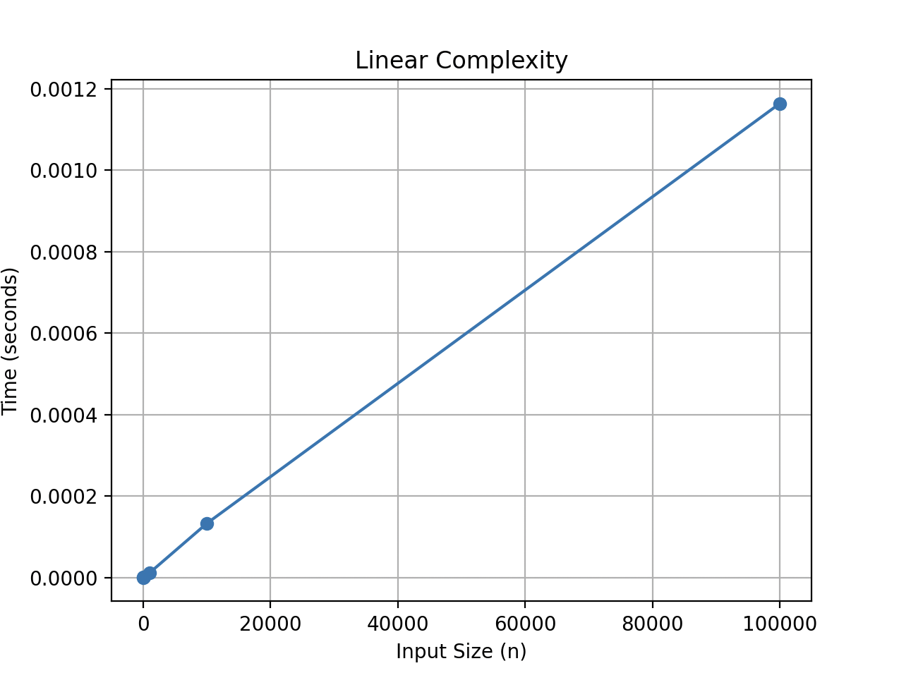
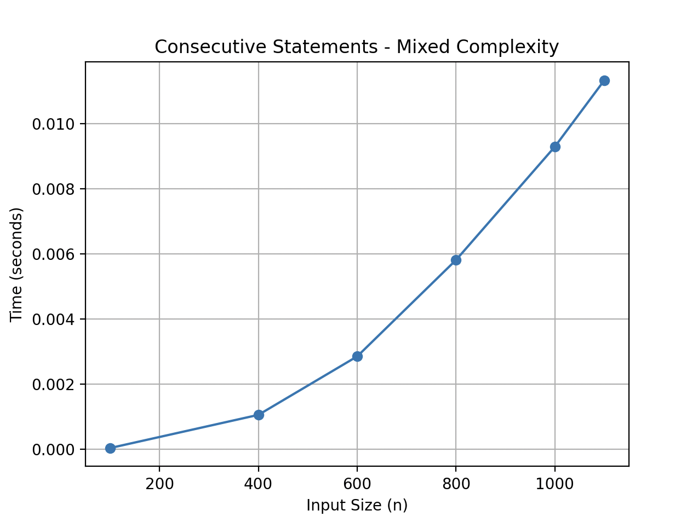

<!--  -->
<p align="center">
 
</p>

# Algoritmos y Estructuras de Datos

## Lab01: Introducction to algorithm design

## Capacidades

- Identificar las importancia de los algoritmos en programación

## Seguridad

- Generar un ambiente seguro
- Evitar el consumo de alimentos
- Dejar el ambiente ordenado y limpio

## Preparación

- El alumno debe revisar previamente el material cargado

## Recursos

- Computadora

## Instrucciones

Cada integrante del grupo debe seleccionar un ejercicio diferente y desarrollarlo con la siguiente estructura.

- **Nombre del alumno**
- **Ejercicio a desarrollar**
- **Prompt engineering**

    - Prompt ingresado y captura
    - Análisis del prompt
    - Ajustes de prompt y captura
    - Comentarios de los compañeros

- **Código**
    - Código desarrollado
    - Análisis del código
    - Comentarios de los compañeros

Desarrollar todo el código en inglés

## Algoritmos y Estructura de Datos 

Dependency Matplotlib

```python
  pip install matplotlib
```

```python

  import matplotlib.pyplot as plt
  data = {10:0.3, 100:0,5 ,1000:0.8}
  plt.scatter(x=data.keys(), y=data.values() , color="Red")
  plt.tittle('Loops')  
  plt.xlabel('Iteractions')
  plt.ylabel('Time(s)')
  plt.show()

```

## Ejercicios

Se debe realizar los ejercicios planteados y un gráfico del tiempo de procesamiento versus los valores de n.

**Funciones que nos permiten realizar medir el tiempo, visualizar la gráfica y ejecutar el algoritmo:**

```python
def measure_time(func, n):
    """Measures execution time of a function"""
    start_time = time.time()
    func(n)
    end_time = time.time()
    return end_time - start_time


def plot_times(n_values, times, title):
    """Plots execution times"""
    plt.plot(n_values, times, 'o-')
    plt.title(title)
    plt.xlabel('Input Size (n)')
    plt.ylabel('Time (seconds)')
    plt.grid(True)
    plt.show()


def run_algorithm(algorithm_func, n_values, title):
    """Runs algorithm and measures execution time for different n values"""
    times = []

    for n in n_values:
        time_taken = measure_time(algorithm_func, n)
        times.append(time_taken)
        print(f"n = {n}, time = {time_taken:.8f} seconds")

    plot_times(n_values, times, title)

```

1. **Logarithmic complexity - O(log n)**
   **Rafael Chuco**
   <p>Calcular el tiempo de procesamiento para un condicional con un bucle simple, los valores de n serán : 1,10, 100, 1000, 10000 , 100000, 1000000. </p>

    - Prompt
    Implement an algorithm with 𝑂(log 𝑛)complexity and measure its execution time for different values of n (1, 10, 100, 1000, 10000, 100000, 1000000). Use a modular function to execute the algorithm and compute the times. Then, plot the results on a logarithmic scale and display a table with the 𝑛 values and their execution times in scientific notation.

    - Prompt analysis
    
    ✅ The prompt is well-structured, clear, and detailed.
    ✅ It avoids ambiguities and ensures clean and efficient code.
    ✅ It includes both execution and visual representation of the data
    
    - Prompt Engineering
    Implement an algorithm with 𝑂(log⁡ 𝑛) complexity and measure its execution time for various values of  𝑛 (1, 10, 100, 1000, 10000, 100000, 1000000). Ensure the implementation follows best coding practices, using modular functions for execution and timing. Display the results in two ways:

      - A table showing the 𝑛 values and their execution times in scientific notation.
      - A graph with a logarithmic scale on the x-axis, clearly labeled and formatted for easy interpretation.
    
    Optimize the code for readability and efficiency, ensuring accurate measurements and a visually appealing plot.

    ****Comments from colleagues****
    - Toledo : A well-formatted table showing 𝑛 values and execution times in scientific notation with aligned columns.
  
    - De la Cruz: A logarithmic plot (using Matplotlib) with a properly labeled x-axis (log scale), a y-axis representing execution time, grid lines for clarity, and markers for data points.


```python

import time
import matplotlib.pyplot as plt

def measure_time(func, n):
    """Measure the execution time of a function with input n."""
    start_time = time.time()
    func(n)
    return time.time() - start_time

def plot_times(n_values, times, title):
    """Plot execution times against input sizes."""
    plt.figure(figsize=(8, 5))
    plt.plot(n_values, times, marker='o', linestyle='-', color='b', label='Tiempo de ejecución (s)')
    plt.xscale('log')  # Set logarithmic scale for better visualization
    plt.xlabel('Tamaño de entrada (n)')
    plt.ylabel('Tiempo de ejecución (s)')
    plt.title(title)
    plt.legend()
    plt.grid(True, which="both", linestyle="--", linewidth=0.5)
    plt.show()

def run_algorithm(algorithm_func, n_values, title):
    """Run algorithm and measure execution time for different n values."""
    times = [measure_time(algorithm_func, n) for n in n_values]

    # Print results in a formatted way
    for n, t in zip(n_values, times):
        print(f"n = {n:7}, tiempo = {t:.8e} segundos")

    plot_times(n_values, times, title)

def logarithmic_algorithm(n):
    """Algorithm with O(log n) complexity (binary reduction)."""
    while n > 0:
        n //= 2  # Integer division by 2 to simulate logarithmic complexity

# Define input sizes
n_values = [1, 10, 100, 1000, 10000, 100000, 1000000]

# Run and visualize the algorithm
run_algorithm(logarithmic_algorithm, n_values, "Complejidad Logarítmica - O(log n)")


```
***Data***




***Graph***




2. **Simple Loop - O(n)**
    **Luis Miguel Toledo**

    Calcular el tiempo de procesamiento para un bucle simple, los valores de n serán: 10^2, 10^3, 10^4, 10^5 y 10^6.

    Prompt Engineering

    **Prompt Entered and Screenshot:**
    Write a Python script to measure the execution time of a loop for different loop sizes (10² to 10⁶) and visualize the results using matplotlib.

    **Prompt Analysis:**
    The prompt clearly specifies the task: measuring execution time and visualizing it. It defines the loop sizes and the libraries to use (timeit and matplotlib). The focus is on understanding the relationship between loop size and processing time.

    **Prompt Adjustments and Screenshot:**
    To improve the visualization of data with large ranges, the prompt was updated to include the use of a logarithmic scale. This will provide a clearer understanding of how the processing time scales with increasing loop sizes.

    **Updated prompt:**
    Write a Python script to measure the execution time of a loop for different loop sizes (10² to 10⁶) and plot the results using matplotlib, with a logarithmic scale for both axes.

    ****Comments from colleagues****
    **Chuco:** The inclusion of the logarithmic scale greatly enhanced the clarity of the plot, particularly for the larger loop sizes. It made it easier to observe how the processing time increases more gradually with smaller loop sizes and more significantly with larger ones.

    **De la Cruz:** Teammates also emphasized that the logarithmic scale helped distinguish the differences in processing times for the larger values of n. Without this scale, the variations in times for larger values could have appeared less noticeable, limiting the interpretability of the data.

```python

    from timeit import default_timer as timer
    import matplotlib.pyplot as plt

    # List of n values
    n_values = [10**2, 10**3, 10**4, 10**5, 10**6]
    times = []

    # Measure processing time for each value of n
    for n in n_values:
        start = timer()
        
        # Simple loop
        for i in range(n):
            pass  # Empty loop to measure only time for iteration

        end = timer()
        proc_time = end - start
        times.append(proc_time)
        print(f"Processing time for n = {n}: {proc_time} seconds")

    # Plotting the results
    plt.figure(figsize=(10, 6))
    plt.plot(n_values, times, marker='o', linestyle='-', color='b')
    plt.title('Processing Time vs Size of n')
    plt.xlabel('Size of n')
    plt.ylabel('Processing Time (seconds)')
    plt.xscale('log')  # Logarithmic scale for n
    plt.yscale('log')  # Logarithmic scale for time
    plt.grid(True)

    # Show plot
    plt.show()


```

***data***



***Graph***



3. **If-then-else statements - O(n)** ***Piero De La Cruz***

    Calcular el tiempo de procesamiento para un condicional con un bucle simple, los valores de n serán: 1, 10, 100, 1000, 10000, 100000.

```python

    def if_then_else(n):
    """Algorithm with conditional O(n) complexity"""
    if n % 2 == 0:
        for _ in range(n):
            pass
    else:
        for _ in range(n):
            pass

    log_condt= [1,10,100,1000,10000,100000]
    run_algorithm(if_then_else,log_condt,'Linear Complexity')

```


4. **Nested Loops - O(n²)**

    Calcular el tiempo de procesamiento para un bucle anidado de nivel 2, los valores de n serán: 100, 400, 600, 800, 1000, 1100.

```python

    def nested_loops(n):
    """Algorithm with O(n²) complexity"""
    for _ in range(n):
        for _ in range(n):
            pass

```

5. **Nested Loops - O(n²)**

    Calcular el tiempo de procesamiento para un bucle simple unido a un bucle anidado de nivel 2, los valores de n serán: 100, 400, 600, 800, 1000, 1100.

```python

    def consecutive_statements(n):
    """Algorithm with O(n + n²) complexity"""
    for _ in range(n):
        pass

    for _ in range(n):
        for _ in range(n):
            pass

    quadratic_n_values = [100, 400, 600, 800, 1000, 1100]
    run_algorithm(consecutive_statements, quadratic_n_values,  
    "ConsecutiveStatements-MixedComplexity")

```


## Identificar Algoritmo

1. Algoritmo 1: n =  1, 10, 100, 1000, 10000

   - It increases in powers of 10: 10^0, 10^1, 10^2, 10^3, 10^4.

   - It can be related to exponential or log-order 𝑂(log 𝑛) complexity analysis algorithms in specific bases.

2. Algoritmo 2: n=  1, 10, 100, 1000 

   - It increases in powers of 10: 10^0, 10^1, 10^2, 10^3.

   - It can be related to exponential or log-order 𝑂(log 𝑛) complexity analysis algorithms in specific bases.

3. Algoritmo 3: n = 1,5,10,50,100,500,1000,5000,10000,50000,100000

    - Here the growth is not uniform, but follows a progressively increasing pattern with some base 5 and 10 jumps.

   - It could represent test points in analysis of algorithms of order 𝑂(𝑛),𝑂(𝑛 log 𝑛), or even binary search in certain implementations.


**Propuesta de algoritmo**

Proponer un algoritmo que resuelva problema e iterar para que mejore.

***Algorithm for adding natural numbers***
- Initial Algorithm
  
The initial algorithm simply adds the numbers from 1 to n using a for loop.
```python
def sum_natural_numbers(n):
    """Suma los primeros n números naturales."""
    total = 0
    for i in range(1, n + 1):
        total += i
    return total

# Ejemplo de uso
n = 100
print(f"La suma de los primeros {n} números naturales es: {sum_natural_numbers(n)}")
```
- Algorithm Improvement
  
We can improve this algorithm by using a mathematical formula to calculate the sum of the first n natural numbers, which reduces the time complexity from O(n) to O(1).

```python
def sum_natural_numbers_optimized(n):
    """Suma los primeros n números naturales utilizando una fórmula matemática."""
    return n * (n + 1) // 2

# Ejemplo de uso
n = 100
print(f"La suma de los primeros {n} números naturales es: {sum_natural_numbers_optimized(n)}")
```


## Conclusiones
1. 

